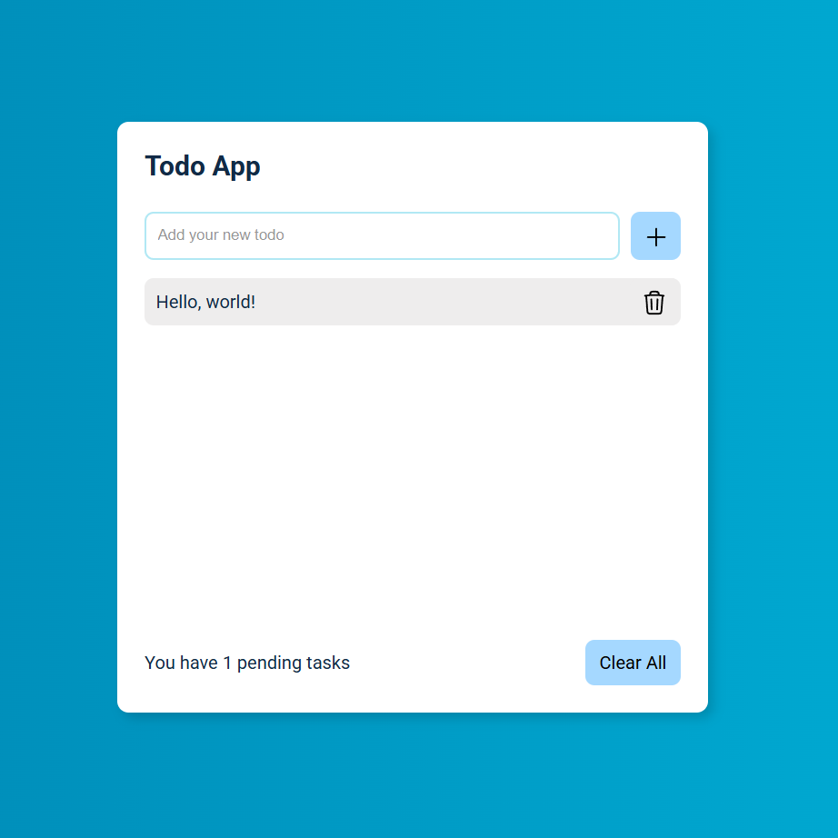

# React Todo App

A simple and clean todo application built with React that helps you manage your daily tasks. Features local storage to persist your tasks between browser sessions.

## Features

- ✅ Add new tasks
- 🗑️ Delete individual tasks
- 🧹 Clear all tasks at once
- 💾 Automatic local storage (tasks persist after page refresh)
- 📱 Clean and responsive design
- 📊 Task counter to show pending tasks

## Demo



## Getting Started

### Prerequisites

- Node.js (version 14 or higher)
- npm or yarn

### Installation

1. Clone the repository:

```bash
git clone https://github.com/IlyaJafari/React-Todo-App.git
```

2. Navigate to the project directory:

```bash
cd react-todo-app
```

3. Install dependencies:

```bash
npm install
```

4. Start the development server:

```bash
npm start
```

5. Open [http://localhost:3000](http://localhost:3000) to view it in your browser.

## Usage

1. **Add a task**: Type your task in the input field and click the + button or press Enter
2. **Delete a task**: Click the trash icon next to any task to remove it
3. **Clear all tasks**: Click the "Clear All" button to remove all tasks at once
4. **Persistence**: Your tasks are automatically saved to local storage and will be there when you return

## Project Structure

```
src/
├── App.js          # Main application component
├── App.css         # Styling for the application
└── index.js        # Entry point
```

## Components

- **App**: Main component that manages state and handles all task operations
- **ToDoForm**: Input form for adding new tasks
- **ToDoList**: Container that renders all todo items
- **ToDoItem**: Individual task component with delete functionality
- **ButtonDelete**: Reusable delete button component
- **Status**: Shows task count and clear all functionality

## Technologies Used

- **React** - Frontend framework
- **JavaScript (ES6+)** - Programming language
- **CSS3** - Styling
- **Local Storage API** - Data persistence

## Available Scripts

In the project directory, you can run:

### `npm start`

Runs the app in development mode. Open [http://localhost:3000](http://localhost:3000) to view it in the browser.

### `npm test`

Launches the test runner in interactive watch mode.

### `npm run build`

Builds the app for production to the `build` folder.

### `npm run eject`

**Note: this is a one-way operation. Once you `eject`, you can't go back!**

## Deployment

### Deploy to GitHub Pages

1. Install gh-pages:

```bash
npm install --save-dev gh-pages
```

2. Add to your `package.json`:

```json
"homepage": "https://IlyaJafari.github.io/react-todo-app",
"scripts": {
  "predeploy": "npm run build",
  "deploy": "gh-pages -d build"
}
```

3. Deploy:

```bash
npm run deploy
```

## Future Enhancements

- [ ] Edit existing tasks
- [ ] Mark tasks as complete/incomplete
- [ ] Filter tasks (all, completed, pending)
- [ ] Due dates for tasks
- [ ] Categories or tags
- [ ] Drag and drop reordering
- [ ] Dark mode toggle

## Contributing

1. Fork the project
2. Create your feature branch (`git checkout -b feature/AmazingFeature`)
3. Commit your changes (`git commit -m 'Add some AmazingFeature'`)
4. Push to the branch (`git push origin feature/AmazingFeature`)
5. Open a Pull Request

## License

This project is licensed under the MIT License - see the [LICENSE](LICENSE) file for details.

## Acknowledgments

- Icons provided by [Heroicons](https://heroicons.com/)
- Built with [Create React App](https://github.com/facebook/create-react-app)

## Contact

Project Link: [https://github.com/IlyaJafari/react-todo-app](https://github.com/IlyaJafari/react-todo-app)
